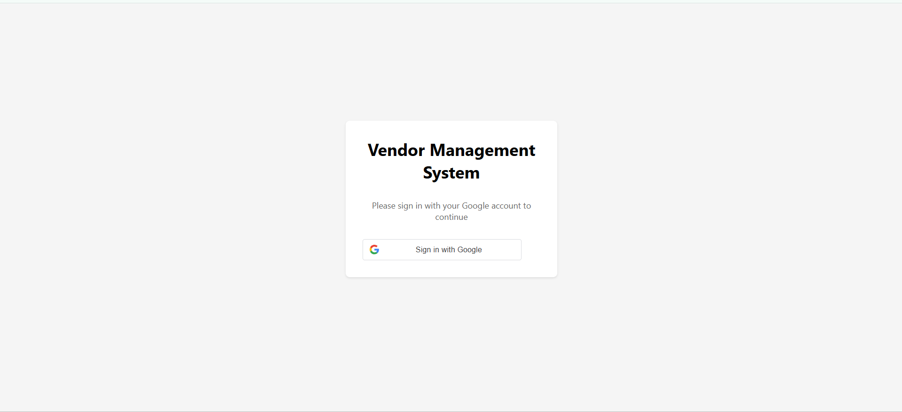
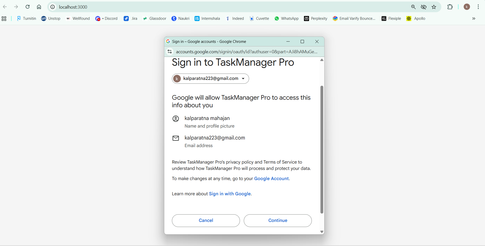
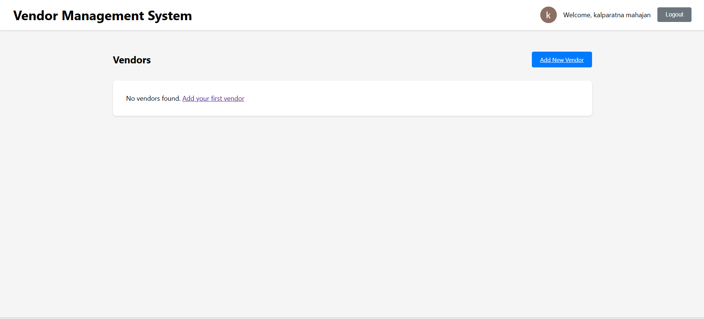
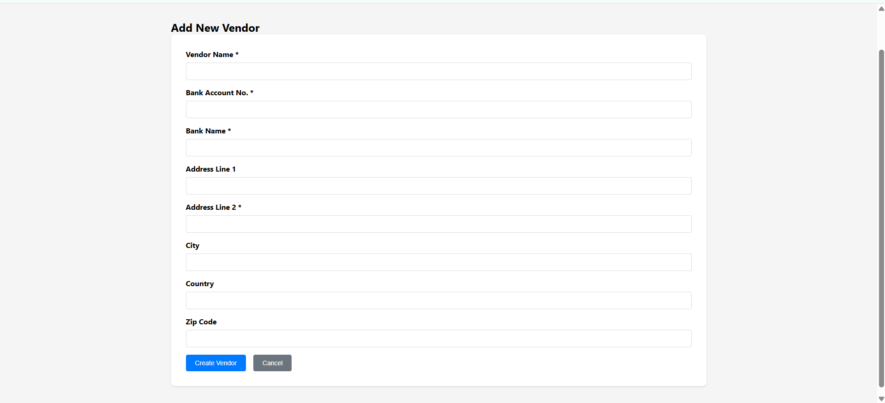
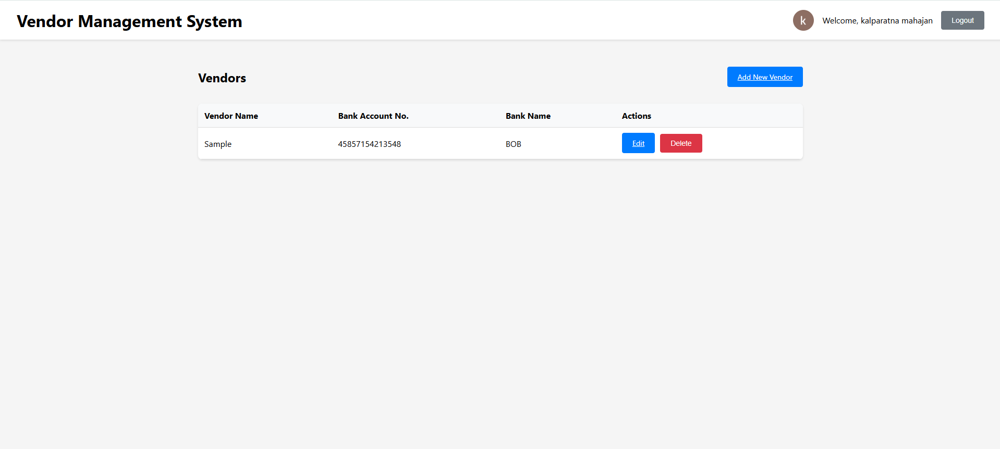
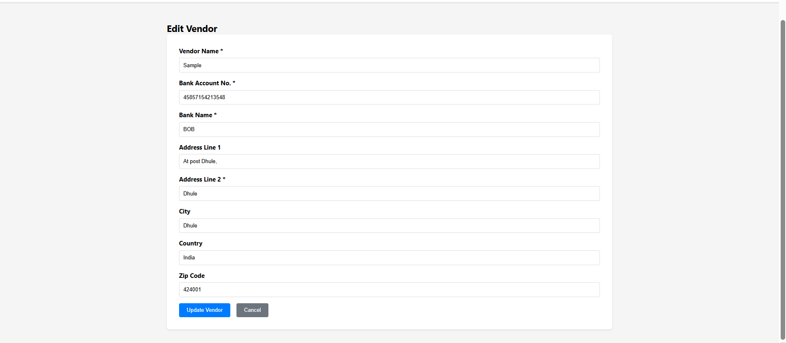

# Vendor Management System

A full-stack web application for managing vendors with Google authentication, built with React (Vite) and Node.js with MongoDB.

## 🖼 UI Screenshots

Here are some sample UI screens from the application:

### 1. Login with Google


### 2. Vendor List (Paginated)


### 3. Create Vendor Form


### 4. Edit Vendor


### 5. Delete Confirmation


### 6. Responsive Mobile View



## ✅ Features Implemented

### 1. Authentication
- **Google Login** - Secure OAuth authentication
- **Google Logout** - Clean session management
- **Protected Routes** - Access control for authenticated users

### 2. Vendor Management
- **Create Vendor** with all required fields:
  - Vendor Name* (mandatory)
  - Bank Account No.* (mandatory) 
  - Bank Name* (mandatory)
  - Address Line 1 (optional)
  - Address Line 2* (mandatory)
  - City (optional)
  - Country (optional)
  - Zip Code (optional)

### 3. Vendor List
- **Paginated Display** - Shows 10 vendors per page
- **Vendor Information** - Name, Bank Account No., Bank Name
- **Edit Link** - Navigate to edit form
- **Delete Link** - Remove vendor with confirmation

### 4. Edit Functionality
- **Load Existing Data** - Pre-populate form with vendor details
- **Update on Submit** - Save changes to database
- **Form Validation** - Required field validation

### 5. Delete Functionality
- **Confirmation Dialog** - "Are you sure?" before deletion
- **Safe Deletion** - Remove from database after confirmation

## 🛠 Tech Stack

- **Frontend**: React 18 with Vite
- **Backend**: Node.js with Express
- **Database**: MongoDB with Mongoose
- **Authentication**: Google OAuth 2.0
- **Routing**: React Router DOM
- **HTTP Client**: Axios
- **Styling**: Custom CSS

## 🚀 Setup Instructions

### Prerequisites
- Node.js (v16 or higher)
- MongoDB (local or Atlas)
- Google Cloud Console account

### 1. Clone and Install
```bash
git clone <repository-url>
cd vendor-management-app
npm install
cd client && npm install && cd ..
```

### 2. Google OAuth Setup
1. Go to [Google Cloud Console](https://console.cloud.google.com/)
2. Create a new project or select existing
3. Enable Google Sign-In API
4. Create OAuth 2.0 credentials
5. Add authorized origins:
   - `http://localhost:3000` (development)
   - Your production domain
6. Copy the Client ID

### 3. Environment Configuration
Update `.env` in root directory:
```env
MONGODB_URI=mongodb://localhost:27017/vendordb
GOOGLE_CLIENT_ID=your_google_client_id_here
PORT=5000
```

Update `client/.env`:
```env
VITE_GOOGLE_CLIENT_ID=your_google_client_id_here
```

### 4. Database Setup
- **Local MongoDB**: Install and start MongoDB service
- **MongoDB Atlas**: Create cluster and get connection string

### 5. Run Application
```bash
# Development mode (runs both frontend and backend)
npm run dev

# Production mode
npm run build
npm start
```

## 📱 Application URLs
- **Frontend**: http://localhost:3000
- **Backend API**: http://localhost:5000
- **API Endpoints**: http://localhost:5000/api/vendors


## 🌐 Deployment Ready

The application is configured for deployment on:
- **Frontend**: Vercel, Netlify, GitHub Pages
- **Backend**: Heroku, Railway, Render
- **Database**: MongoDB Atlas

### Environment Variables for Production
```env
MONGODB_URI=your_production_mongodb_uri
GOOGLE_CLIENT_ID=your_google_client_id
PORT=5000
NODE_ENV=production
```

## 📋 API Endpoints

| Method | Endpoint | Description |
|--------|----------|-------------|
| GET | `/api/vendors` | Get paginated vendors list |
| GET | `/api/vendors/:id` | Get single vendor |
| POST | `/api/vendors` | Create new vendor |
| PUT | `/api/vendors/:id` | Update vendor |
| DELETE | `/api/vendors/:id` | Delete vendor |

## 🎯 Assignment Requirements Met

✅ **Login with Google & Logout** - Implemented with Google OAuth  
✅ **Create Vendor** - Form with all mandatory and optional fields  
✅ **Paginated Vendor List** - Shows name, bank account, bank name with edit/delete links  
✅ **Edit Vendor** - Loads data and updates on submit  
✅ **Delete Vendor** - Confirmation dialog before deletion  
✅ **React Frontend** - Built with Vite React  
✅ **Node.js Backend** - Express server with REST API  
✅ **MongoDB Database** - Mongoose ODM for data management  
✅ **Deployment Ready** - Configured for cloud deployment  

## 🔒 Security Features
- Google OAuth authentication
- Protected API routes
- Input validation
- CORS configuration
- Environment variable protection

## 📱 Responsive Design
- Mobile-friendly interface
- Clean, modern UI
- Intuitive navigation
- Loading states and error handling